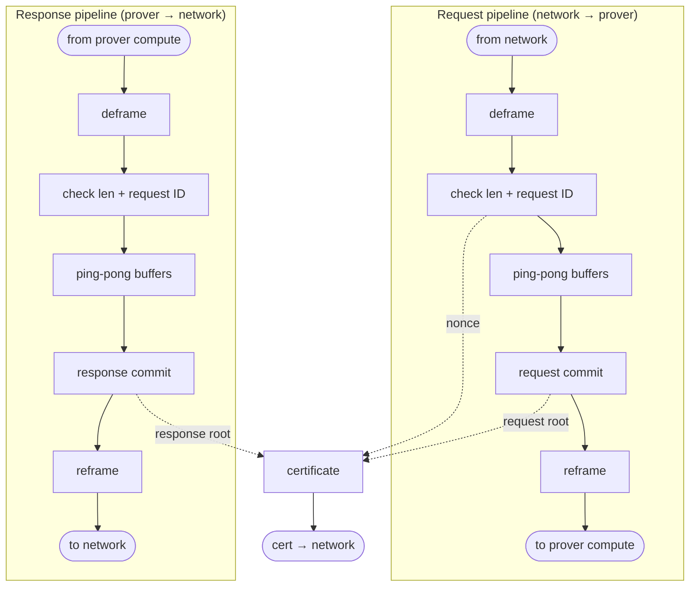

# Interlock certificate & packet protocol

Protocol update consolidating the **packet / record / certificate formats**, the
**challenge protocol**, the **time-bracketing argument**, and the **prover ↔
interlock dataflow**. Parsed from design notes (2026-06).

**Scope of the initial implementation:** single **input → output packet pairs**
(one request, one response) — *not* multi-step exchanges or payloads spanning
several packets. The `reference request ID` field (below) is in place so that
multi-turn / multi-packet flows can be added later without a format change.

See also: [`bucket-declaration-spec.md`](bucket-declaration-spec.md) (the
`bucket number` field, exact-match drop, and tick beacon) and
[`interlock-protocol.md`](interlock-protocol.md) / [`verification-protocol.md`](verification-protocol.md).

---

## 1. Threat-model assumptions

The interlock is assumed to be:

- **Reset-resistant** — it cannot be forced to restart at `bucket = 0`; the bucket
  counter is monotonic (battery-backed with the key).
- **Speedup-resistant** — beyond roughly **2×** speedup.
- **HMAC-secret-protecting** — the certificate HMAC key never leaves the interlock.
- **Tamper-proof internal memory** — running state (counters, hash contexts, key)
  cannot be tampered with.

These underpin the time-bracketing argument in §5.

---

## 2. Packets

Every packet is `header ‖ encrypted payload`. All header integers are big-endian.

### Input (request) packet

| field | purpose |
|---|---|
| length | payload length |
| request ID | unique, monotonically increasing id |
| bucket number | prover-declared bucket |
| reference request ID | references a previous request whose data this request uses (see below) |
| recomputation commitment | hash of the cryptographic info needed to recompute the output (e.g. `H(key)`) |
| encrypted payload | the ciphertext |

### Output (response) packet

| field | purpose |
|---|---|
| length | payload length |
| request ID | the request ID of the input it is paired with |
| bucket number | prover-declared bucket |
| encrypted payload | the ciphertext |

The output packet carries **no** recomputation commitment (recomputation is keyed
off the input) and **no** reference request ID.

> **Request ↔ response pairing is by request ID:** a response carries the same
> request ID as the input it answers, so no separate reference field is needed on
> the output.
>
> **Reference request ID** (request packets only) lets a request **use data from a
> previous request** — e.g. a multi-turn exchange where a later request depends on
> an earlier one. The initial implementation only exercises single input→output
> pairs; committing this field now lets such cross-request dependencies be expressed
> later without a format change.

### Packet hash

```
H(PACKET) = H( HEADER ‖ H(CIPHER) )
```

The ciphertext is hashed separately as a **separable leaf** (`H(CIPHER)`), so a
challenge can open `HEADER ‖ H(CIPHER)` and prove a packet's identity **without
revealing the plaintext**. The interlock computes `H(PACKET)` itself (and the
prover re-derives it for its log) — it is never trusted from the wire.

---

## 3. Records, buckets, certificate

### Record

```
record = ( length , packet_hash )
```

The record commits **only** the length and the packet hash — deliberately **not**
the request ID or any other header field. This lets the verifier:

- index into a **randomly-selected byte position** within a bucket using only the
  per-packet `length` values (size arithmetic), and
- open the **one** challenged packet,

**without revealing every other packet's metadata** (request IDs, references, etc.).

> Change from the earlier design: the record was `(length, request_id,
> packet_hash)`; `request_id` is dropped from the record (it remains inside the
> packet header and is therefore still committed via `packet_hash`).

### Bucket hash

```
bucket_hash = H( record_1 ‖ record_2 ‖ … ‖ record_k )      (ordered, per direction)
            = H( (length, packet_hash)(length, packet_hash) … )
```

One bucket hash per direction (input / output) per bucket.

### Overall hashes

```
overall_in  = H( in_bucket_hash_1  ‖ in_bucket_hash_2  ‖ … ‖ in_bucket_hash_1000 )
overall_out = H( out_bucket_hash_1 ‖ out_bucket_hash_2 ‖ … ‖ out_bucket_hash_1000 )
```

A hash over the **sequence of per-bucket hashes**, one chain per direction. With
`num_buckets = 1000`, each certificate covers 1000 buckets × N packets per bucket.

### Interlock certificate

| field |
|---|
| version |
| interlock id |
| freshness nonce |
| bucket start |
| num_buckets ( = 1000 ) |
| overall_in  (hash of the input bucket-hash sequence) |
| overall_out (hash of the output bucket-hash sequence) |
| HMAC of the certificate contents |

The certificate commits the two overall hashes; the **sequence of bucket hashes**
itself is revealed by the prover at challenge time (§4), not carried in the cert.

---

## 4. Challenge protocol

```
1. Verifier → Prover           : a fresh nonce.
2. Prover  → Interlock         : feeds the nonce in.
3. Interlock → Prover → Verifier: an interlock certificate carrying that nonce
                                  (this reveals the recent bucket number).
4. Verifier → Prover           : randomly selects a bucket y and byte x, up to and
                                  including the most recent bucket — challenge
                                  "byte x in bucket y".
5. Prover  → Verifier          : evidence of EITHER
                                    (a) the packet occupying byte x in bucket y had
                                        hash z, OR
                                    (b) byte x in bucket y was empty (from the total
                                        length of the bucket's packets);
                                  plus the opening material:
                                    - the sequence of bucket hashes,
                                    - the values used to compute the queried bucket
                                      hash,
                                    - the values used to compute the queried packet
                                      hash.
6. Input binding               : the prover also supplies the certificate of the
                                  INPUT paired with the challenged output (the input
                                  carrying the same request ID), binding the output
                                  to a real, single-use request.
```

The size-weighted random `(bucket, byte)` selection samples *transmitted bytes*
uniformly; the `(length, packet_hash)` records make the position arithmetic
possible without exposing unchallenged packets.

---

## 5. Time bracketing

Because the certificate carries the verifier's nonce, the verifier knows the cert
was generated **after** the nonce was issued and **before** the cert was received —
bracketing the wall-clock window in which the committed state existed. Combined with
**reset-** and **speedup-resistance**, this bounds how much work the prover could
have inserted in that window.

> **Open question (flagged in the source notes):** is nonce → certificate
> round-trip bracketing **sufficient** given the reset / speedup-resistance
> assumptions? — to analyze.

---

## 6. I/O timing discipline

To keep packet **timing** from becoming a side channel:

- **Writes are always allowed.**
- **Read buffering** is sized by `f( max pipeline latency , max packet write time )`
  — reads are held in a bounded buffer so their timing doesn't leak pipeline state.
- Reads follow a **Read A → wait → Read B** pattern.

> **TODO / needs detail:** the exact semantics of "read" vs "write" here, and the
> precise Read A / Read B timing, were not fully specified in the source notes.
> Documented at the sketch level above; to be pinned down (the intent is to bound
> the read-timing channel).

---

## 7. Responsibilities & log format

| component | responsibilities |
|---|---|
| **Interlock** | ethernet communication; information isolation; information certificates |
| **Prover frontend** | record keeping; ethernet |

**Log format (to align on): a list of packets.** Requirements:

- The prover frontend must be able to **recreate the exact serial representation of
  the buffer** from the union of the packet descriptions in its log.
- The tap's output must depend **only** on information already in the buffer plus
  newly-generated information (no hidden state) — so the log **fully determines** the
  committed certificate, and the prover's recomputation matches the interlock's
  byte-for-byte.

---

## 8. Prover ↔ interlock dataflow

Two mirrored pipelines (request and response), each `deframe → check length +
request ID → ping-pong buffers → commit → reframe`. A `certificate` node bridges
them, fed by the response commit, the request commit, and the nonce (from a
check-length stage). The link to the prover compute and the link to the network
are each **shared** (multiple flows multiplexed onto one physical resource).



The two pipelines are drawn as **independent parallel lanes**, both flowing
top→bottom; the certificate sits beside them, fed on dotted edges.

- **Request lane** (network → prover): `deframe → check → ping-pong → request
  commit → reframe`.
- **Response lane** (prover → network): `deframe → check → ping-pong → response
  commit → reframe`.
- **Certificate**: produced from the response commit + request commit + the nonce
  (taken from the request-pipeline check stage), emitted to the network.
- The **ping-pong buffers** are identical double-buffers on both lanes.

**Shared physical links** (kept out of the diagram so the lanes stay parallel):
the **prover-compute side** is one shared ethernet link carrying both the request
(down) and the response (up); the **network side** is one shared bus carrying the
response, the certificate, and the request. The lane endpoints (`from/to network`,
`from/to prover compute`, `cert → network`) mark where each lane taps those links.

> **To confirm:** (i) whether the nonce is taken from the request-pipeline check
> stage or a dedicated stage; (ii) whether the network-side bus's three flows
> (response, certificate, request) share one physical link while staying logically
> separate (assumed here) vs. a single merged output. The unlabeled fan-out boxes
> in the original sketch are rendered here as the ping-pong double-buffers.

---

## 9. Changes vs. the prior protocol

- **Record** is now `(length, packet_hash)` (was `(length, request_id,
  packet_hash)`) — enables random-position challenge openings without revealing
  unchallenged packets' metadata.
- **Packet header** gains `bucket number` (prover-declared bucket) and, on request
  packets only, `reference request ID` (lets a request reuse data from a previous
  request). Request and response are paired by `request ID`.
- Consolidated the certificate fields, the challenge/opening protocol, the
  time-bracketing argument, and the dataflow into this one document.
