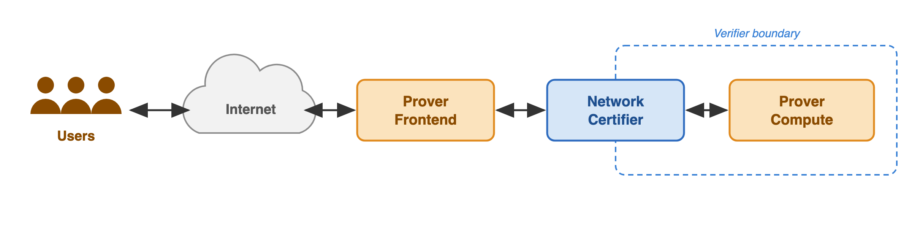
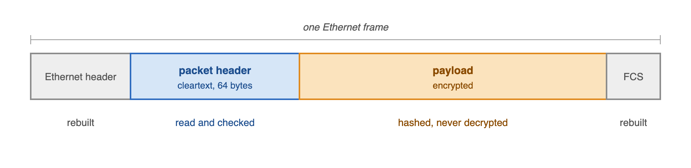
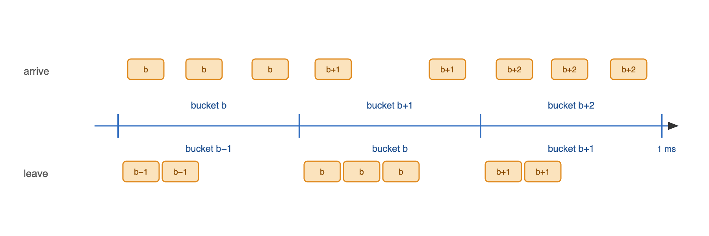
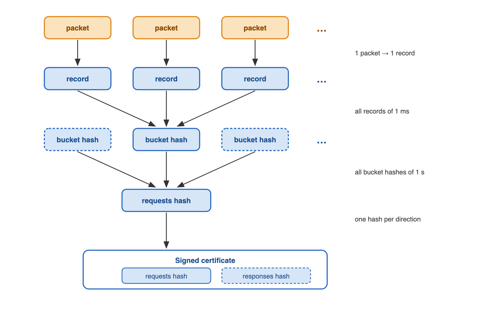

# Inference Verification Prototype: Protocol, FPGA Network Certifier, and Recomputation Options

## TL;DR

We prototyped the verification protocol of the paper *Verifying AI Compute by Bounding Unexplained Information Exfiltration*: a way for a verifier to bound how much information leaves a prover's AI compute node that a declared computation cannot explain, without trusting the prover's hardware or software. Three pieces make it work. A small trusted device, the *Network Certifier FPGA*, sits on the node's only network path, filters and then hashes all traffic, and regularly emits a signed certificate. The prover keeps the logs and, when challenged, opens the matching log slice against the certificate. A challenge-proof step then turns the opened response into a bound U on unexplained information, by isolated recomputation or by a zero-knowledge proof of the inference.

## 1. Background

[The paper](https://openreview.net/forum?id=qtgG5HZSsk) proposes a way for a compute operator (the *prover*) to show an outside party (the *verifier*) that an AI compute node is running only its declared inference workload, when neither side trusts the other's hardware or software. The node is isolated behind a device on its only network path, all traffic is hash-committed as it passes, and the verifier periodically challenges the prover to show that a randomly chosen output was well predicted by a compliant computation on the recorded inputs. The gap between the output and that prediction is the *unexplained information* U, an upper bound on what could have been smuggled out.

We developed a messaging protocol, the network certifier on an FPGA, the challenge flow around it, and two of the three recomputation options. This note describes what we built, how it maps onto the paper, and what we measured.

## 2. Overview of the proposal

*Figure 1. The workload path*

Users send inference requests over the internet to the prover's **frontend**, which encrypts each request, wraps it in a small cleartext header, and keeps a log of everything it sends and receives. The request then crosses the **Network Certifier**, the verifier's device, on its way to the quarantined **compute node**, and the response comes back the same way. The certifier checks every packet against a few rules, hashes it, and emits it in bursts (buckets) to minimise timing side-channel bandwidth. Once per second it signs a certificate over everything that crossed. The **verifier** is remote: it holds the key the certifier signs with, sends nonces and challenges to the frontend, and never sees plaintext messages.

| Component | Role |
|---|---|
| Prover frontend | Terminates customer traffic, handles encryption and protocol format, keeps the logs |
| Prover compute | Handles encryption and protocol format, runs the inference |
| Network Certifier | Applies compliance checks to the packets, hashes the traffic, signs certificates |

The protocol runs in two phases. In the **workload phase** traffic flows as usual and the certificates are injected into the traffic to be sent to the verifier. In the **challenge phase**, the verifier picks a random position in the output traffic, and asks the prover to verifiably demonstrate the entropy of the data in that position. With enough samples, the verifier can be highly confident that the amount of covert information potentially encoded in the traffic not more than an estimated value.

## 3. Traffic on the wire

*Figure 2. Packets on the wire*

The certifier understands exactly one kind of traffic: plain Ethernet frames, each carrying one protocol packet, a cleartext header followed by an encrypted payload. Anything else is dropped. The header is the only part the certifier reads; the payload it only hashes.

### 3.1 Ethernet frames

Ethernet is used only so that ordinary network interfaces can be used on both sides of the network certifier; the protocol itself does not rely on it.

An Ethernet frame carries more than its payload: the header and checksum fields could be used to smuggle data, so the certifier does not forward these at all. It builds a fresh frame from scratch on the other side.

### 3.2 Packet header

The header is what the certifier checks (layout in Appendix A). It contains the metadata of the packet such as a unique ID, length and timing information. The header must pass several protocol compliance checks or it is simlpy dropped by the ceritifier. The prover notices a drop by timeout and retries.

### 3.3 Timing buckets

When a packet is sent is information too. Even with every byte of payload accounted for, a sender could signal through the exact moment it transmits. The certifier minimizes this channel by making time coarse and explicit.

*Figure 3. Timing buckets*

The certifier's clock divides time into 1 ms buckets. Every packet header carries the number of the bucket it is being sent in, and the certifier accepts a packet only if it arrives during that bucket; a packet stamped with any other bucket is dropped. Accepted packets are held and released together at the end of the bucket. From outside, all that can be seen is which bucket a packet belonged to, and that is written in the packet itself, so it is hashed and certified with the rest.

To stamp packets correctly the sender has to be in sync with the certifier's clock. Once per millisecond the certifier sends a short sync packet back to the sender on each side, carrying the number of the bucket that just closed and how far into it that side's first packet arrived; the sender uses this to keep its independent clock in sync (§3.4).

### 3.4 Certificates

Once per second the certifier sends the frontend a **certificate** (layout in Appendix A). It carries one hash of the request traffic and one of the response traffic, a verifier nonce to indicate freshness and is cryptographically signed by a secret key.

The two traffic hashes are built in layers (Figure 4): each packet becomes a record; the records of a bucket are hashed together; and buckets within a second are also hashed together. The layers exist so that a challenge can open a single packet with minimal data sent to the verifier.

*Figure 4. How trafic hashes are built*

### 3.5 Control packets

The certificate travels as a packet of its own: using an ID reserved for this purpose. Two more control packets are identified the same way, by a reserved id in the header. All three are kept out of the traffic hashes.

| Packet | Id | Direction | Description |
|---|---|---|---|
| Certificate | 0 | certifier → frontend | Carries the certificate (see above) |
| Nonce | 0 | frontend → certifier | Loads a new nonce into the certifier to indicate freshness |
| Sync | 1 | certifier → each sender | Timing feedback to keep the senders' independent bucket clocks in sync |
